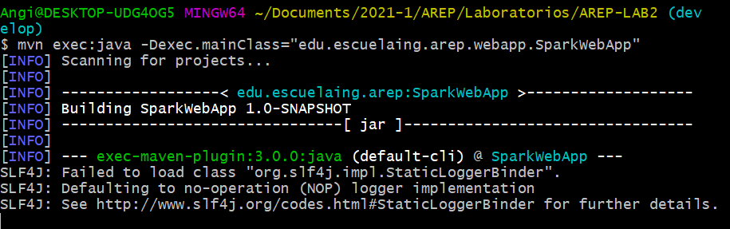
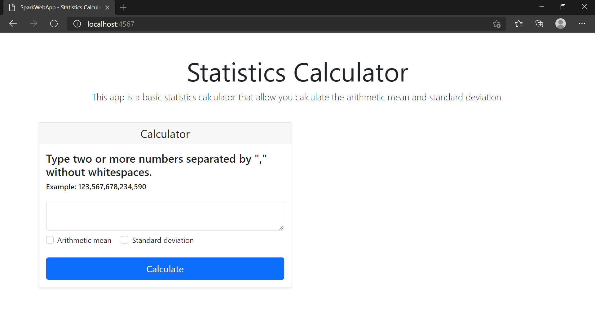
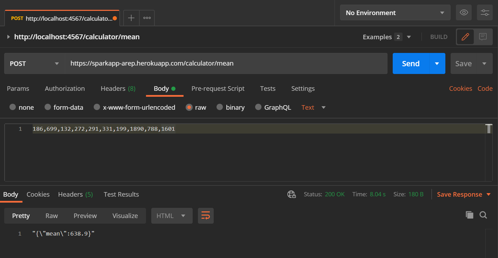
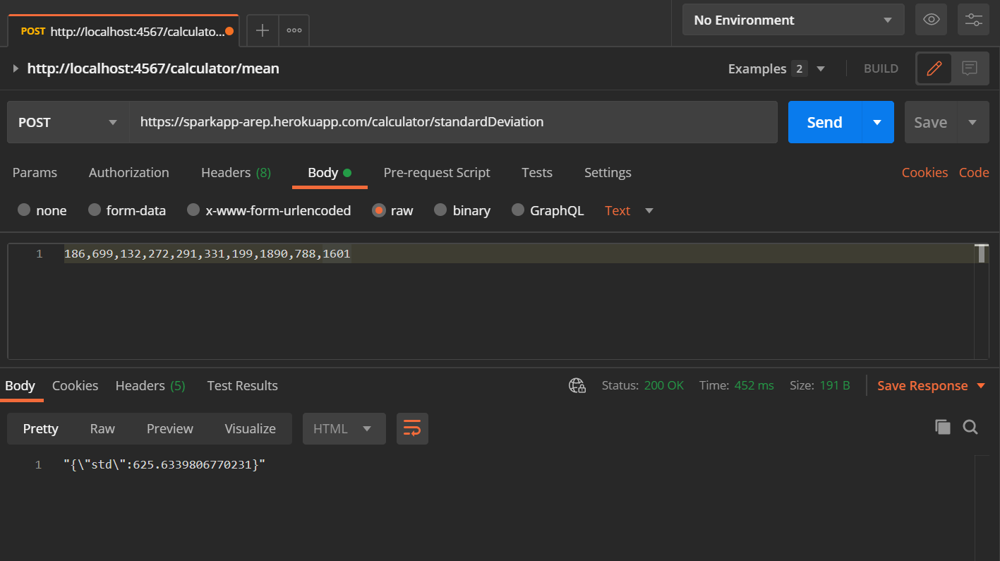

# Laboratory 2 - Introduction To Heroku

This project is implement a basic extendable statistics calculator with two main functionalities
* Calculate the arithmetic mean.
* Calculate standard deviation.

## Getting started
### Prerequisites
* Git
* Maven
* Java SE Development Kit 8
* Java SE Runtime Environment 8
* Heroku CLI
* Postman (Optional)

### Installing
1. To use this project, you must clone it in your computer. Use the folliwing command:

       git clone https://github.com/angipaola10/AREP-LAB2.git

2. You must build the project, for that you enter to the directory 'AREP-LAB2' in the command terminal and run the following command:

       mvn package

3.  Once the project is built, you can execute it with Maven in the following way:

        mvn exec:java -Dexec.mainClass="edu.escuelaing.arep.webapp.SparkWebApp"
        
    You will see the next output:
    
    
    
    You must enter http://localhost:4567/ in your browser. You will see:
    
    
    
4. If you want open a local Heroku Server you can execute the next command:

       heroku local web
       
    After, you can access the local server at http://localhost:5000 .

### Tests
1. You must enter to the directory 'AREP-LAB2' in the command terminal and run the following command:

       mvn test
    
2. If you want test the endpoints that calculate the mean and standard deviation, you can do it using [postman](https://www.postman.com/). This endpoints only accept text on the body request. Examples:

    * Testing endpoint: https://sparkapp-arep.herokuapp.com/calculator/mean :
    
    
    * Testing endponit: https://sparkapp-arep.herokuapp.com/calculator/standardDeviation :
    
    

## Build With
* [Maven](https://maven.apache.org/) - Dependency Management
* CircleCI for CI 
  
* Build to Heroku
    
* [Spark](http://sparkjava.com/) - Spark Java Framework

## Documentation
This repository contains a [paper](/Document.pdf) that describes the proccess performed to make the program, but if you need aditional iformation in the directory [docs](/docs) you find the documentation of site. 

### Instructions 
If you want generate the documentation of this program, you must follow the next steps:
1. Run the next command to create the documenation:

       mvn javadoc:javadoc
       
2. Now, if you want, you can generate a site to see the documentation. Use the next command: 

       mvn site
       
3. To see the site created, you must run the next command:

       mvn site:run
       
    Enter http://localhost:8080 in your browser to see the site with the documentation.

## Author
* Angi Paola Jiménez Pira - Student at the *Colombian School of Engineering Julio Garavito.*

## License
This project is licensed under the GNU v3.0 - see the [LICENSE.md](LICENSE.md) file for details

    